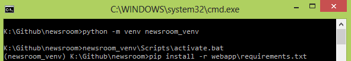
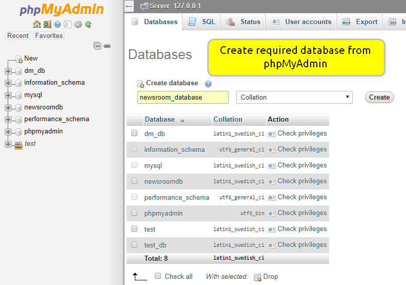
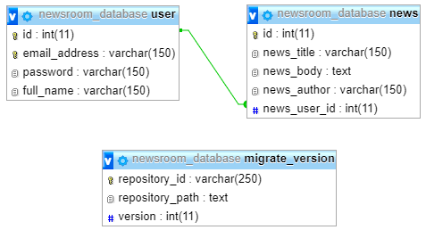
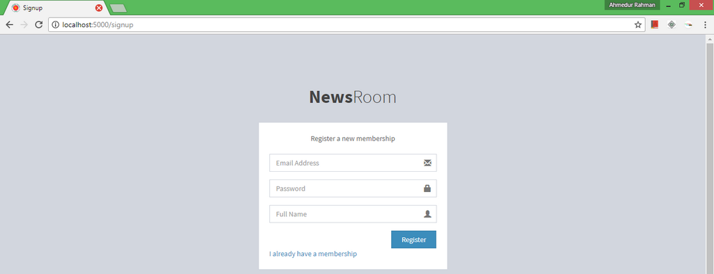
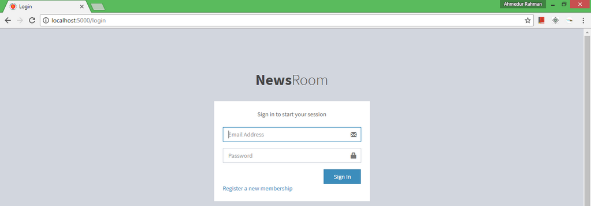
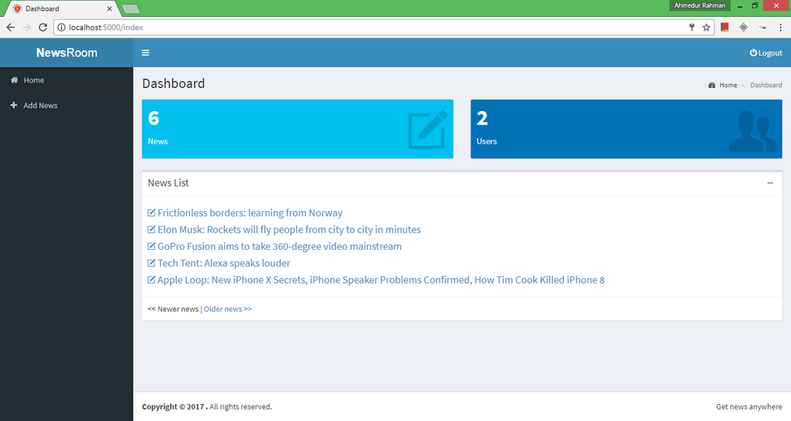
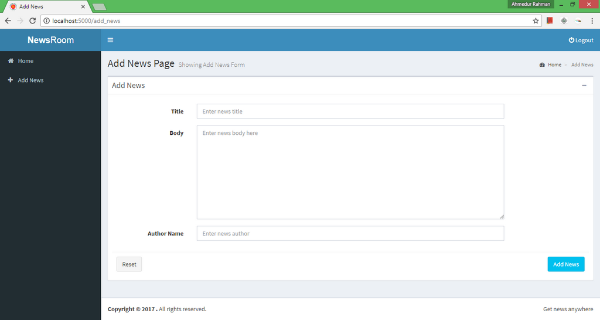
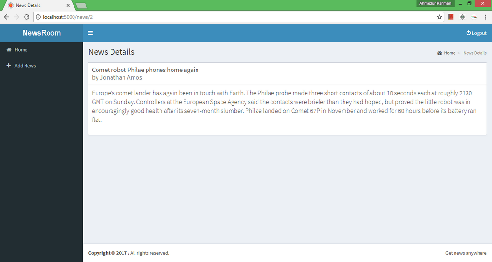
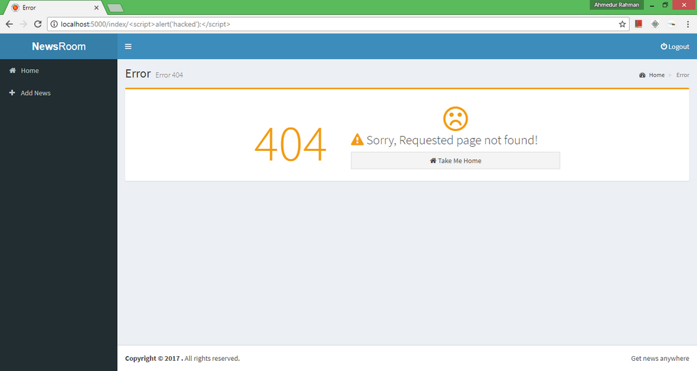
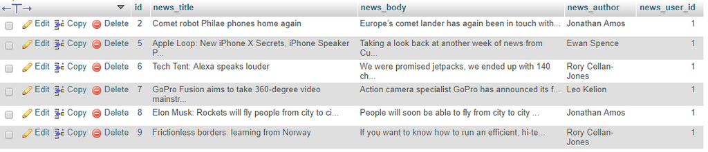

Newsroom
========

A web application for storing and managing news stories.

## Milestones

### Phase 1 (Completed)

   - Necessary package installation
   
   - Database creation
   
   - Sign up and login system for users

   - A page to list all stored news

   - A page to create new news

### Phase 2 (Running)

   - Add JSON format for each news

   - Update story list page to include JSON link

### Phase 3
 
   - Add date field in news form

   - Modify database design
   
   - Add XML format for each news

   - Update story list page to include XML link

### Phase 4

   - Add edit and delete functinoalities for each news

   - Delete function should include confirmation alert
   
## Software Requirements

The following environment are used to develop the application:

- **OS** : Windows 8.1 (64 bit)
- **IDE** : PyCharm Professional (Version: 2017.2.3)
- **Database Server** : XAMPP (Version 3.2.2) as it includes both MySQL and phpMyAdmin
- **Python** : 3.6.2 (64 bit)
- **MySQL** : 10.1.21-MariaDB

### Necessary Package Installation

- Install virtual environment

		$ python -m venv newsroom_venv

- Activate virtual environment (Change it based on your OS)

		$ newsroom_venv\Scripts\activate.bat

- Install necessary packages included in requirements.txt

		$ pip install -r webapp\requirements.txt

In CMD, the above commands are executed like below:

		
		
### Database Configuration

- From phpMyAdmin create database `newsroom_database`

- Activate virtual environment (if not activated)

		$ newsroom_venv\Scripts\activate.bat

- Change directory to webapp

		$ cd webapp

- Change MySQL configuration in `config.py` using own MySQL username, password and database name. 
Here my MySQL username is root, password is empty and database name is newsroom_database

		$ SQLALCHEMY_DATABASE_URI = 'mysql://root:@localhost/newsroom_database'

- To create the database run `db_create.py`. Run only after first configuration. It will create migration folder.

		$ python db_create.py

- To track down the schema changes of database, I have used migration techniques.
To migrate database run `db_migrate.py`. This script should run after every modification in database schema.

		$ python db_migrate.py

The relationship between table looks like below in phpMyAdmin

		
		
### To Run the Application

- Activate virtual environment (if not activated)

		$ newsroom_venv\Scripts\activate.bat

- Run the `application.py`

		$ python application.py

### What is this repository for?

- Quick summary
- Version Controlling
- Screenshot enlisting of each phase (See attached Screenshot folder)
- [Issue Tracking](https://bitbucket.org/arsho/newsroom/issues)

### Phase 1 Output

- Registration page for new user

- Login page for existing user

- Home page for logged in user

- Add news page for adding new news to database

- News details page for single news

- XSS check in address bar using custom error page

- Database table from phpMyAdmin

